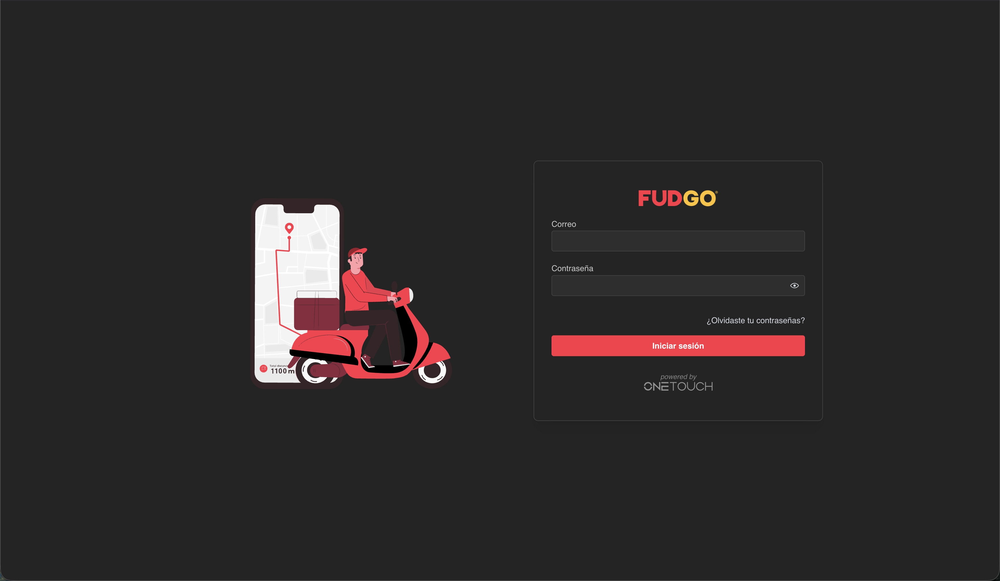
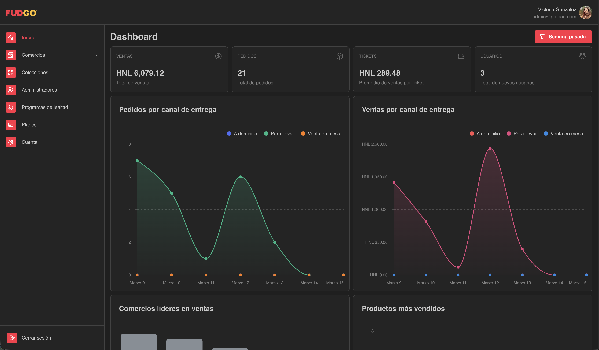
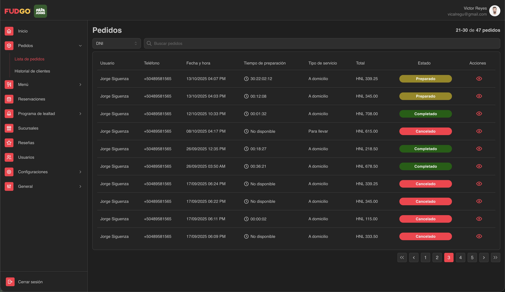
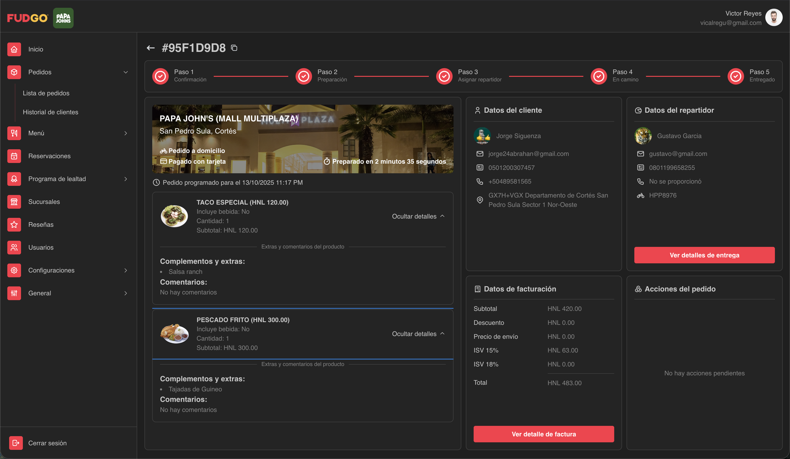
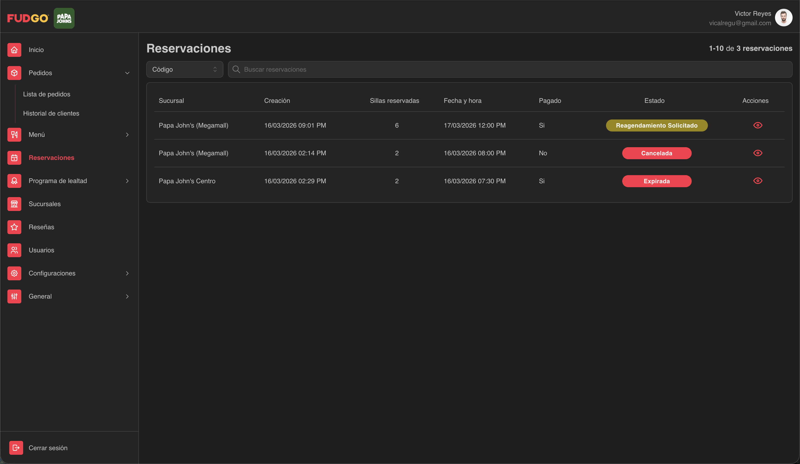
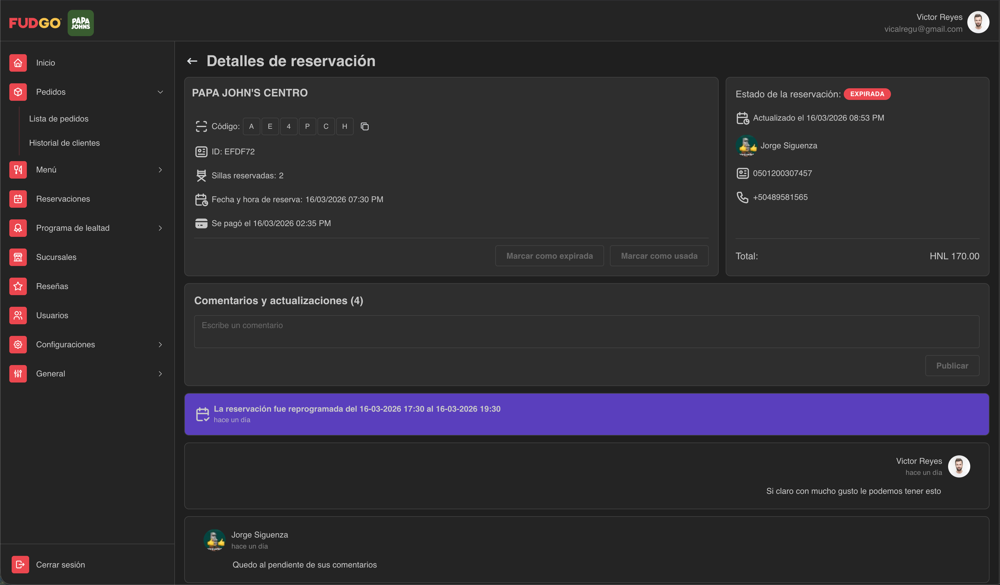
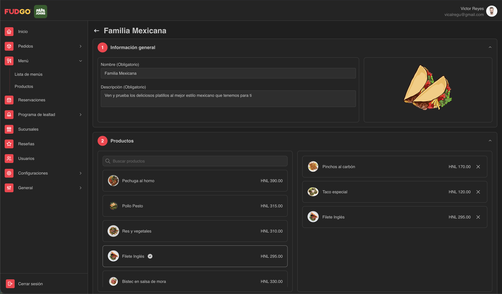
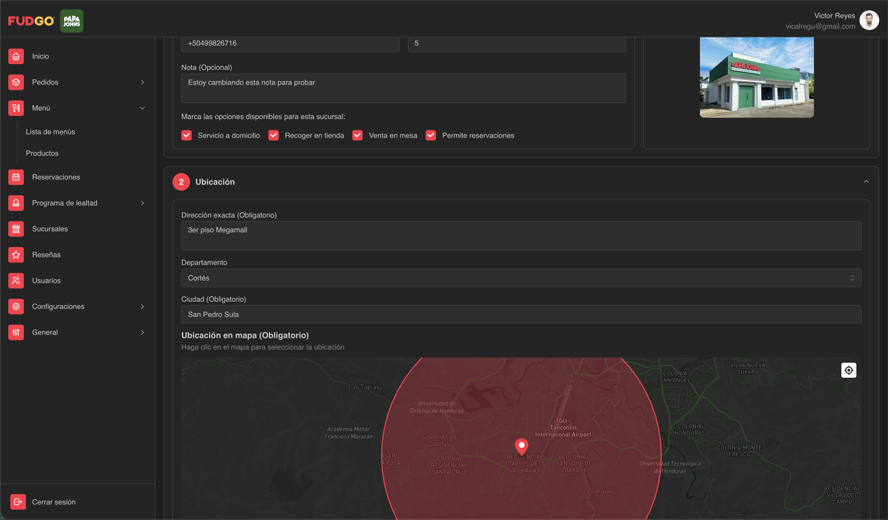
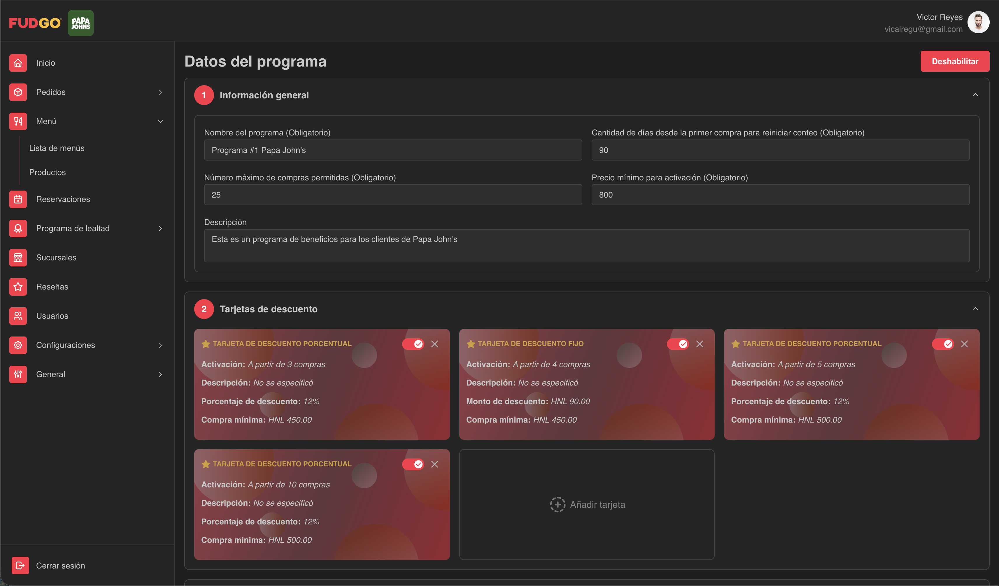
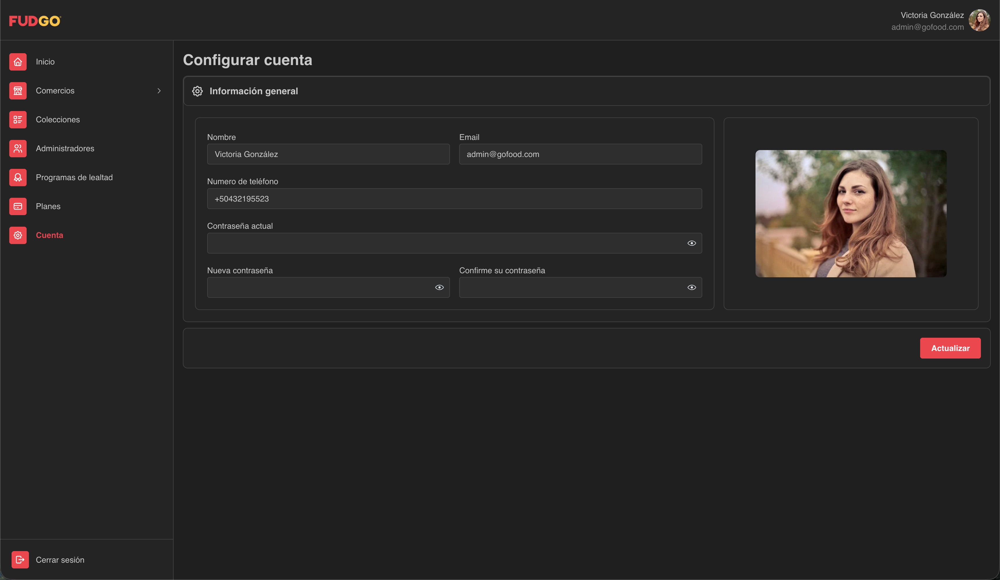

# Fudgo Dashboard

Panel administrativo web para la operación de comercios y restaurantes dentro del ecosistema Fudgo. El proyecto está construido con React + Vite y concentra flujos de administración, operación diaria y configuración del negocio en una sola interfaz.

## Descripción general

Este dashboard permite gestionar comercios, sucursales, usuarios, menús, productos, pedidos, reservaciones, promociones, cupones, programas de lealtad, reseñas y planes. También incorpora notificaciones en tiempo real, mapas con Mapbox, validación avanzada de formularios y navegación protegida por roles.

## Qué incluye el sistema

### Módulos principales

- Dashboard con métricas, tablas y gráficas de desempeño.
- Gestión de comercios y sucursales con ubicación en mapa, horarios y datos de contacto.
- Gestión de menús y productos, incluyendo categorías, complementos, extras, bebidas, adicionales y reglas de pago.
- Gestión operativa de pedidos con detalle, estados, historial, asignación y seguimiento.
- Gestión de reservaciones con detalle, comentarios, cambios de estado, aprobación, cancelación, expiración y marcación de uso.
- Gestión de promociones, cupones y descuentos.
- Programa de lealtad y seguimiento de recompensas.
- Gestión de colecciones, tipos de cocina y etiquetas.
- Gestión de reseñas y configuración del negocio.
- Gestión de usuarios administrativos y cuentas.
- Gestión de planes para la plataforma.

### Roles soportados

- `Súper administrador`
  Administra comercios, administradores, planes, colecciones, programas de lealtad y catálogos globales.
- `Administrador de restaurante`
  Opera el comercio completo: pedidos, menús, productos, sucursales, reservaciones, usuarios, configuraciones, promociones, cupones, lealtad, historial y reseñas.
- `Administrador de sucursal`
  Opera sucursal: pedidos, menús, productos, reservaciones, programa de lealtad, cuenta, contraseña, historial y reseñas.
- `Cajero`
  Trabaja con pedidos, menús, productos, reservaciones, programa de lealtad y cuenta.
- `Cocinero`
  Gestiona pedidos activos, historial de pedidos y ajustes personales.

### Capacidades técnicas destacadas

- Rutas protegidas por rol con `react-router-dom`.
- Estado global con Redux Toolkit.
- Middleware de refresco de token para reintento de thunks cuando el backend devuelve `token_expired`.
- Notificaciones en tiempo real con `socket.io-client`.
- UI basada en Mantine, con utilidades complementarias de Tailwind CSS.
- Formularios con `react-hook-form`, `zod` y `yup`.
- Mapas y geolocalización con Mapbox.
- Soporte para carga de imágenes y archivos.
- Gráficas y reportes con Mantine Charts, Recharts y Google Charts.

## Stack tecnológico

- React 18
- Vite 5
- Mantine 7
- Redux Toolkit
- React Router DOM 6
- Axios
- Socket.IO Client
- Mapbox GL / react-map-gl
- Tailwind CSS
- React Hook Form
- Zod / Yup

## Estructura del proyecto

```text
src/
  api/            Clientes por dominio para consumir el backend
  assets/         Imágenes, sonidos, iconos y animaciones
  components/     Componentes reutilizables de UI y helpers
  context/        Contextos compartidos
  hooks/          Hooks personalizados, incluyendo sockets
  layout/         Layouts públicos y privados
  routes/         Definición de rutas y navegación por rol
  screens/        Pantallas del sistema por módulo
  services/       Configuración base y variables de entorno
  store/          Redux store, slices y middleware
  theme/          Tokens visuales y colores
  utils/          Utilidades, constantes y esquemas de validación
```

## Capturas del sistema

Las capturas del sistema se encuentran en `docs/screenshots/`.

### Capturas incluidas

- `docs/screenshots/login.png`
- `docs/screenshots/dashboard.png`
- `docs/screenshots/orders-list.png`
- `docs/screenshots/order-details.png`
- `docs/screenshots/reservations-list.png`
- `docs/screenshots/reservation-details.png`
- `docs/screenshots/menu-management.png`
- `docs/screenshots/branches-map.png`
- `docs/screenshots/loyalty-program.png`
- `docs/screenshots/settings.png`

#### Inicio de sesión



#### Dashboard principal



#### Gestión de pedidos



#### Detalle de pedido



#### Gestión de reservaciones



#### Detalle de reservación



#### Menús y productos



#### Sucursales y mapa



#### Programa de lealtad



#### Configuraciones



## Requisitos para ejecutar el proyecto

- Node.js 18 o superior
- npm 9 o superior
- Acceso al backend correspondiente
- Variables de entorno válidas
- Credenciales de Mapbox para los módulos de ubicación

## Variables de entorno

Puedes partir del archivo `.env.example`.

### Variables base

```env
VITE_APP_ENV=dev
VITE_API_URL=http://localhost:3000/
VITE_API_ACCESS_TOKEN=
VITE_API_TIMEOUT=10000
VITE_API_RETRY_COUNT=3
```

### Variables de Mapbox

```env
VITE_MAPBOX_ACCESS_TOKEN=
VITE_MAPBOX_STYLE_URL=
VITE_MAPBOX_LIGHT_STYLE_URL=
VITE_MAPBOX_DARK_STYLE_URL=
VITE_MAPBOX_LAT_DEFAULT=
VITE_MAPBOX_LNG_DEFAULT=
VITE_MAPBOX_KEY=
```

### Qué hace cada variable

- `VITE_APP_ENV`: ambiente actual de la app. Valores comunes: `dev`, `stg`, `prd`.
- `VITE_API_URL`: URL base del backend para peticiones HTTP y conexión de sockets.
- `VITE_API_ACCESS_TOKEN`: token base usado por la capa de servicios.
- `VITE_API_TIMEOUT`: timeout por defecto para requests.
- `VITE_API_RETRY_COUNT`: número máximo de reintentos configurado para la capa de servicios.
- `VITE_MAPBOX_ACCESS_TOKEN`: token de acceso a Mapbox usado en mapas de sucursales.
- `VITE_MAPBOX_STYLE_URL`: estilo principal del mapa.
- `VITE_MAPBOX_LIGHT_STYLE_URL`: estilo claro para formularios o vistas con tema light.
- `VITE_MAPBOX_DARK_STYLE_URL`: estilo oscuro para formularios o vistas con tema dark.
- `VITE_MAPBOX_LAT_DEFAULT`: latitud por defecto para centrar el mapa.
- `VITE_MAPBOX_LNG_DEFAULT`: longitud por defecto para centrar el mapa.
- `VITE_MAPBOX_KEY`: variable disponible en la capa de servicios; conservar si tu entorno o integración la requiere.

## Instalación y ejecución local

### 1. Instalar dependencias

```bash
npm install
```

### 2. Crear el archivo de entorno

```bash
cp .env.example .env
```

Luego edita `.env` con los valores reales del ambiente.

### 3. Ejecutar el proyecto en desarrollo

```bash
npm run dev
```

Vite levantará la aplicación en una URL similar a:

```text
http://localhost:5173
```

### 4. Compilar para producción

```bash
npm run build
```

### 5. Previsualizar el build

```bash
npm run preview
```

## Scripts disponibles

- `npm run dev`: inicia el entorno de desarrollo con Vite.
- `npm run build`: genera el build de producción.
- `npm run preview`: sirve localmente el build generado.
- `npm run release`: ejecuta build y luego versionado con `standard-version`.
- `npm run lint`: intenta correr ESLint sobre el proyecto.

> Nota: la configuración actual de lint usa `.eslintrc.cjs`. Si trabajas con ESLint 9 puro, puede ser necesario migrar a Flat Config o ajustar la ejecución del comando.

## Flujo recomendado para arrancar el proyecto

1. Clona el repositorio.
2. Instala dependencias con `npm install`.
3. Crea tu `.env` a partir de `.env.example`.
4. Verifica que el backend y las credenciales de Mapbox estén activos.
5. Ejecuta `npm run dev`.
6. Inicia sesión con un usuario válido del ambiente correspondiente.

## Integraciones importantes

- **Backend REST**: todas las llamadas salen desde `src/api/`.
- **Sockets**: el proyecto escucha eventos en tiempo real para pedidos y reservaciones.
- **Mapbox**: se utiliza en creación y detalle de sucursales.
- **Notificaciones**: Mantine Notifications y `react-hot-toast`.
- **Autenticación**: navegación protegida y manejo de sesión por rol.

## Buenas prácticas para este repositorio

- No subas archivos `.env`.
- No subas secretos de Mapbox ni tokens de acceso.
- No subas `dist/` al repositorio.
- Si agregas nuevas variables de entorno, actualiza este README y `.env.example`.
- Si agregas nuevas pantallas importantes, añade su captura en `docs/screenshots/`.

## Módulos que vale la pena revisar primero

- `src/App.jsx`: registro principal de rutas por rol.
- `src/routes/index.js`: navegación y permisos por perfil.
- `src/store/store.js`: configuración del store global.
- `src/components/NotificationProvider.jsx`: notificaciones y eventos en tiempo real.
- `src/screens/Orders/`: operación de pedidos.
- `src/screens/Reservations/`: operación de reservaciones.
- `src/screens/Users/`: cuenta, negocio y configuraciones.

## Estado actual de la documentación

Este README ya documenta la estructura, el stack y la forma de ejecutar el proyecto. Las capturas están preparadas para añadirse en `docs/screenshots/` cuando quieras completar la documentación visual.
